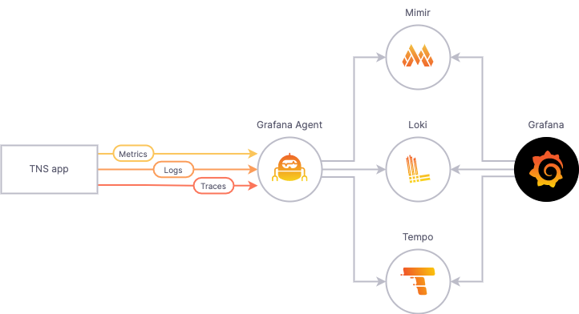

# The New Stack (TNS) observability app

This readme has the following sections:

- [The New Stack (TNS) observability app](#the-new-stack-tns-observability-app)
  - [Overview](#overview)
  - [Prerequisites](#prerequisites)
    - [Docker](#docker)
    - [K3D](#k3d)
    - [kubectl](#kubectl)
    - [Tanka](#tanka)
      - [Reviewing the Tanka code](#reviewing-the-tanka-code)
    - [Jsonnet-bundler](#jsonnet-bundler)
  - [Install TNS demo](#install-tns-demo-running-mlt-stack-locally)
  - [Explore metrics to logs to traces](#explore-metrics-to-logs-to-traces)
  - [Explore metrics to traces to logs](#explore-metrics-to-traces-to-logs)
  - [Explore logs to traces with LogQL v2](#explore-logs-to-traces-with-logql-v2)
  - [Disable TNS cluster](#disable-tns-cluster)
  - [Remove TNS cluster](#remove-tns-cluster)
  - [Contributing guidelines](#contributing-guidelines)
    - [Modify TNS application:](#modify-tns-application)
    - [Update Grafana dashboards and kubernetes infrastructure:](#update-grafana-dashboards-and-kubernetes-infrastructure)

## Overview

The New Stack (TNS) is a simple three-tier demo application, fully instrumented with the 3 pillars of observability: metrics, logs, and traces. It offers an insight on what a modern observability stack looks like and experience what it's like to pivot among different types of observability data.



The TNS app is an example three-tier web app built by Weaveworks. It consists of a data layer, application logic layer, and load-balancing layer. To learn more about it, see [How To Detect, Map and Monitor Docker Containers with Weave Scope from Weaveworks](https://thenewstack.io/how-to-detect-map-and-monitor-docker-containers-with-weave-scope-from-weaveworks/).

The instrumentation for the TNS app is as follows:

- Metrics: Each tier of the TNS app exposes metrics on `/metrics` endpoints, which are scraped by the Grafana Agent. Additionally, these metrics are tagged with exemplar information. The Grafana Agent then writes these metrics to Mimir for storage. 

- Logs: Each tier of the TNS app writes logs to standard output or standard error. It is captured by Kubernetes, which are then collected by the Grafana Agent. Finally, the Agent forwards them to Loki for storage.

- Traces: Each tier of the TNS app sends traces in Jaeger format to the Grafana Agent, which then converts them to OTel format and forwards them to Tempo for storage.

Visualization: A Grafana instance configured to talk to the Mimir, Loki, and Tempo instances makes it possible to query and visualize the metrics, logs, and traces data.


## Prerequisites

If you are running the full metrics, logs and traces stack locally, install and configure _all_ of the following software applications.

If you wish to only deploy the TNS app to an existing K8s cluster using the `app-only` option, install and configure `kubectl`, `tanka`, and `jsonnet-bundler`.

### Go

Since much of the program is written in Go, you should have have Go installed on your local machine. Click [here] (https://go.dev/doc/install) for installation instructions.

### Docker

Make sure you have Docker installed and verify it is running with `docker ps`. No errors means it is running. For Docker download and installation instructions, click [here](https://docs.docker.com/install/).

If using Linux and you see an error similar to `permission denied while trying to connect to the Docker daemon socket at unix:///var/run/docker.sock` then make sure you are in the `docker` group. This will ensure that you are able to run Docker without using the `sudo` command.
```sh
$ sudo usermod -aG docker <username>
```
Logout and then login again for the changes to take effect.

### K3D

To run the TNS demo, you need a Kubernetes cluster. The cluster creation script uses `k3d` which runs as a single node cluster inside Docker. The specific version to use depends on your operating system:
- For Ubuntu 20.04 and lower, use (https://github.com/rancher/k3d/releases/tag/v3.2.0).
- For Ubuntu 21.10 and higher (which has cgroups v2 enabled by default, and k8s fails to start thinking cgroups are not available), use (https://github.com/rancher/k3d/releases/tag/v5.0.0)
- For MacOS, you can install the latest version via homebrew: ```brew install k3d```

**Note:** Ensure that your Docker daemon has a minimum of 2.5 GB of total memory available for all pods in this deployment to be scheduled.

You can also run the TNS demo without Kubernetes. Click [here](https://github.com/grafana/tns/blob/main/production/docker-compose/README.md) for more information.

### kubectl

The TNS demo uses `kubectl` to interact with the Kubernetes clusters. Click [here](https://kubernetes.io/docs/tasks/tools/install-kubectl/) for `kubectl` installation instructions.

### Tanka

Tanka uses the Jsonnet language to interact with Kubernetes, via the `kubectl` tool. Click [here](https://tanka.dev/install#tanka) for installation instructions.

#### Reviewing the Tanka code

When you install the TNS demo application, it will create a `tanka` directory in your TNS checkout. This directory contains all of the Jsonnet resources used to install this demo.
To find out more about Tanka, see https://tanka.dev.

### Jsonnet-bundler

The Jsonnet bundler downloads Jsonnet dependencies. Click [here](https://tanka.dev/install#jsonnet-bundler) for installation instructions.

After the installation type ```jb``` in the terminal to make sure it is added to the system path and working.

## Install TNS demo (running MLT stack locally)

These instructions assume that you are using a local `k3d`. If you plan to use a Kubernetes cluster other than a local `k3d` one, you will need to modify these instructions for your setup.

1. Clone the TNS repository.
    ```sh
    $ git clone https://github.com/grafana/tns
    $ cd tns
    ```

1. Install K3D cluster.
    ```sh
    $ ./create-k3d-cluster
    $ export KUBECONFIG=$(k3d kubeconfig write tns)
    ```

1. Install TNS demo application:
    ```sh
    $ ./install
    ```

1. Confirm `yes` when prompted. You will be prompted five times during the installation.

    Wait for the installation to finish. It can take over ten minutes for everything to download and then start up.

1. Verify the status of your cluster by running this command.

    ```sh
    $ kubectl get pods -A
    ```
    If all the pods are listed as either `running` or `completed`, your cluster is ready for use.

1. Access TNS using the URL [http://localhost:8080/](http://localhost:8080).

Note: If you need to re-do this process to get everything running, you can run `k3d cluster delete tns` to delete the cluster, then run `./create-k3d-cluster` and re-start the process.

## Install TNS demo app into an existing K8s cluster (`app-only` option)

If you already have a K8s cluster *and* cloud metrics, logs, and traces services available to you, use the `app-only` option to deploy _only_ the instrumented TNS app to a Kubernetes cluster.

1. Get Kubernetes context
    ```sh
    $ kubectl config get-contexts
    ```
    Note down the context you'd like to use to deploy the app.

1. Deploy the app
    ```sh
    $ ./install CONTEXT_YOU_NOTED app-only
    ```

1. Confirm `yes` when prompted.

1. Verify the status of your cluster by running this command.

    ```sh
    $ kubectl get pods -n tns-cloud
    ```
    If all the pods are listed as either `running`, your app is ready for use.

## Install TNS demo app connected to Grafana Cloud (`grafana-cloud` option)

Note: this requires an existing K8S cluster.

1. Get Kubernetes context
    ```sh
    $ kubectl config get-contexts
    ```
    Note down the context you'd like to use to deploy the app.

1. Deploy the app
    ```sh
    $ ./install CONTEXT_YOU_NOTED grafana-cloud
    ```

1. You will need to provide your organization name (slug), API Token, and stack.

    - To create an Access Policy and Token, go to https://grafana.com/orgs/<your_slug>/access-policies
    - Create new access policy with the minimum privileges: 
      - Realms: the stack you wish to send TNS data to
      - Scopes: stacks:read, logs:write, metrics:write, profiles:write
    - Create new access token for this policy

1. Confirm `yes` when prompted about applying changes to your cluster

1. Verify the status of your cluster by running this command.

    ```sh
    $ kubectl get pods -n tns-cloud
    ```
	If all the pods are listed as either `running`, your app is ready for use.


After a few minutes, you will see metrics arriving in your Grafana instance. At this point, you can also enable the [Kubernetes Integration](https://grafana.com/docs/grafana-cloud/kubernetes-monitoring/) - the agent is already configured for you!


## Explore metrics to logs to traces

The following instructions will help you go from metrics to logs to traces.

1. Open the TNS dashboard.
1. Zoom in on a section of a panel with failed requests.
1. From the panel drop-down, click Explore.
1. In the Explore view, go to the data source drop-down and select Loki.
1. Click to expand a logline with a `TraceID` field.
1. Click the Tempo button next to the `TraceID` field to view the trace.

## Explore metrics to traces to logs

The following instructions will help you go from metrics to traces to logs.

1. In Grafana, go to the Explore view.
1. From the data source drop-down, select Mimir.
1. Run the following query: `histogram_quantile(.99, sum(rate(tns_request_duration_seconds_bucket{}[1m])) by (le))`
1. Click on a data point to see the exemplar data in an overlay, then click "Query with Tempo" in the examplar overlay. (If no data points appear, make sure exemplars are enabled in the query options.)
1. In the trace viewer, click the log icon of one of the span lines to view log details.

## Explore logs to traces with LogQL V2

1. In Grafana, go to the Explore view.
1. From the data source drop-down, select Loki.
1. Run the following query: `{job="tns/app"} | logfmt | level="info" | status>=500 and status <=599 and duration > 50ms`
1. Click to expand a logline with a `TraceID` field.
1. Click the Tempo button next to the `TraceID` field to view the trace.

## Disable TNS cluster

To disable your cluster, run this command:

```sh
$ k3d cluster stop tns
```

To re-enable the cluster, run this command:

```sh
$ k3d cluster start tns
```

## Remove TNS cluster

To remove your cluster, run this command:

```sh
$ k3d cluster delete tns
$ rm -rf tanka
```

## Contributing guidelines

### Modify TNS application:

- Run `make` to compile the code and tag new images in your local Docker image registry, after you have modified the source code of the TNS demo application,
- Instruct `k3d` to pull the new images on a pod restart (and not use the image from its local cache): `k3d image import -c tns grafana/tns-app && k3d image import -c tns grafana/tns-db && k3d image import -c tns grafana/tns-loadgen`.
- Kill relevant pod(s) by running the following command: `kubectl delete pod app-69db48747b-s6qq6 --namespace=tns`.

### Update Grafana dashboards and kubernetes infrastructure:

- Update the manifests by running the following tanka command: `tk apply --force environments/<ENV>/main.jsonnet`.
- Update Grafana, for example, when changing dashboards by running the following tanka command: `tk apply --force environments/default/main.jsonnet`.

## Using TNS for Grafana Development

The setup in this repo can help provide you with everything you need to use TNS' setup to work with local Grafana development. For more information, see the README in production/docker-compose.
