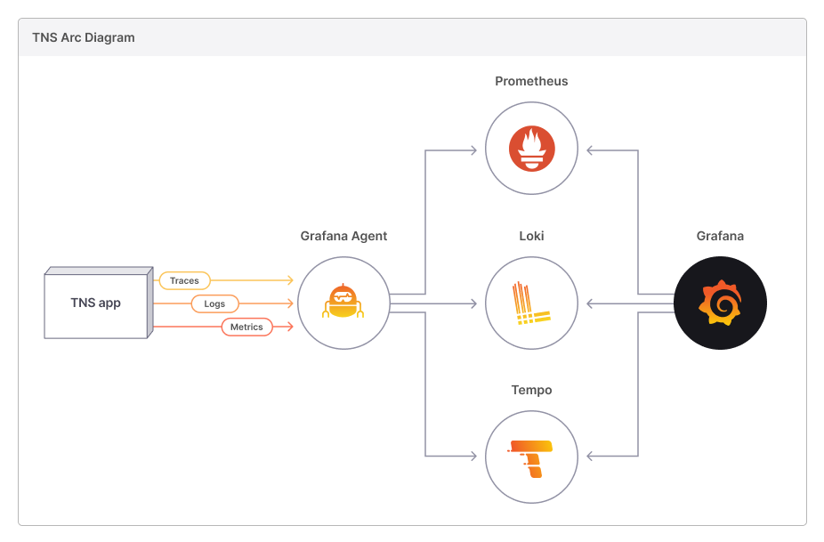

# The New Stack (TNS) observability app

This readme has the following sections.

- [Overview](#overview)
- [Prerequisites](#prerequisites)
- [Install TNS demo](#install-tns-demo)
- [Explore metrics to logs to traces](#explore-metrics-to-logs-to-traces)
- [Explore metrics to traces to logs](#explore-metrics-to-logs-to-traces)
- [Explore LogQL V2](#explore-logql-v2)
- [Disable TNS cluster](#disable-tns-cluster)
- [Remove TNS cluster](#remove-tns-cluster)
- [Troubleshooting](#troubleshooting)
- [Contributing guidelines](#contributing-guidelines)

## Overview

The New Stack (TNS) is a simple three-tier demo application, fully instrumented with the 3 pillars of observability: metrics, logs, and traces. It offers an insight on what a modern observability stack looks like and experience what it's like to pivot among different types of observability data.



The TNS app is an example three-tier web app built by Weaveworks. It consists of a data layer, application logic layer, and load-balancing layer. To learn more about it, see [How To Detect, Map and Monitor Docker Containers with Weave Scope from Weaveworks](https://thenewstack.io/how-to-detect-map-and-monitor-docker-containers-with-weave-scope-from-weaveworks/).

The instrumentation for the TNS app is as follows:

- Metrics: Each tier of the TNS app exposes metrics on /metrics endpoints, which are scraped by the Grafana Agent. Additionally, these metrics are additionally tagged with exemplar information. The Grafana Agent then writes these metrics to a Prometheus (with remote-read enabled) for storage. [While the Prometheus could scrape metrics from the TNS App directly, the demo is configured to make the Agent the central point through which metrics, logs, and traces are collected. The Prometheus can be substituted for any backend which accepts Prometheus remote write, such as Thanos or Cortex.]
- Logs: Each tier of the TNS app writes logs to <somewhere>, which are then collected by the Grafana Agent, which forwards them on to Loki for storage. 
- Traces: Each tier of the TNS app sends traces in Jaeger format to the Grafana Agent, which then converts them to OTel format and forwards them to Tempo for storage. 
Visualization: A Grafana instance configured to talk to the Prometheus, Loki, and Tempo instances make it possible to query and visualize the metrics, logs, and traces data. 


## Prerequisites

Before you begin, install and configure the following software applications.

### Docker

Verify you have Docker installed. For download and installation instructions, click [here](https://docs.docker.com/install/).

### K3D

To run the TNS demo, you need a Kubernetes cluster. Download `k3d` from [here](https://github.com/rancher/k3d/releases/tag/v3.2.0). The `k3d` Kubernetes distribution used here runs as a single node cluster inside docker. 

**Note:** Ensure that your Docker daemon has a minimum of 2.5 GB of total memory available for all pods in this deployment to be scheduled.

You can also run the TNS demo without Kubernetes. Click [here](https://github.com/grafana/tns/blob/main/production/docker-compose/README.md).
 for more information.

### kubectl

The TNS demo uses `kubectl` to interact with the Kubernetes clusters. Click [here](https://kubernetes.io/docs/tasks/tools/install-kubectl/) for `kubectl` installation instructions.

### Tanka

Tanka uses the Jsonnet language to interact with Kubernetes, via the `kubectl` tool. Click [here]((https://github.com/grafana/tanka/releases/tag/v0.7.1) for installation instructions.

#### Reviewing the Tanka code

When you install the TNS demo application, it will create a `tanka` directory in your TNS checkout. This directory contains all of the Jsonnet resources used to install this demo.
To find out more about Tanka, see https://tanka.dev.

### Jsonnet-bundle

The Jsonnet bundler download Jsonnet dependencies. Click [here]((https://github.com/jsonnet-bundler/jsonnet-bundler/releases/tag/v0.4.0) for download instructions.

After downloading the library:

1. Rename the downloaded binary to `jb` and move it to a location specified in `$PATH`, for example, `/usr/local/bin`.
1. Verify that the binary is executable:
    ```
    $ chmod +x /usr/local/bin/jb
    ```

## Install TNS demo

These instructions assume that you are using a local `k3d`. If you plan to use a Kubernetes cluster other than a local `k3d` one, you will need to modify these instructions for your setup.

1. Clone the TNS repository.
    ```sh
    $ git clone https://github.com/grafana/tns
    $ cd tns
    ```

1. Install K3D cluster.
    ```sh
    $ ./create-k3d-cluster
    $ export KUBECONFIG=$(k3d kubeconfig write tns)
    ```

    If you see an error similar to `permission denied while trying to connect to the Docker daemon socket at unix:///var/run/docker.sock`, then add yourself to the `docker` group. This will ensure that you are able to run Docker without using the `sudo` command.
    ```sh
    $ sudo usermod -aG docker <username>
    ```
    Logout and then login again for the changes to take effect.

1. Install TNS demo application:
    ```sh
    $ ./install
    ```

1. Confirm `yes` when prompted. You will be prompted four times during the installation.

    Wait for the installation to finish. It can take over ten minutes for everything to download and then start up.

1. Verify the status of your cluster by running this command.

    ```sh
    $ kubectl get pods -A
    ```
    If all the pods are listed as either `running` or `completed`, your cluster is ready for use.

1. Access TNS using the [URL](http://localhost:8080/](http://localhost:8080).


## Explore metrics to logs to traces

The following instructions will help you go from metrics to logs to traces.

1. Open the TNS dashboard.
1. Zoom in on a section of a panel with failed requests.
1. From the panel drop-down, click Explore.
1. In the Explore view, go to the data source drop-down and select Loki.
1. Choose a logline with a traceID of Tempo.

## Explore metrics to traces to logs

The following instructions will help you go from metrics to logs to traces.

1. In Grafana, go to the Explore view.
2. From the data source drop-down and select Prometheus.
3. Run the following query.
`histogram_quantile(.99, sum(rate(tns_request_duration_seconds_bucket{}[1m])) by (le))`
4. Click on an exemplar data.
5. Click on the log icon on a span line to view the log details.

### Explore LogQL V2

1. In Grafana, go to the Explore view.
2. From the data source drop-down and select Loki.
3. Run the following query.
 `{job="tns/app"} | logfmt | level="info" | status>=500 and status <=599 and duration > 50ms`
4. Choose a logline with a traceID of Tempo.

## Disable TNS cluster

To disable your cluster, run this command:

```sh
$ k3d cluster stop tns
```

To re-enable the cluster, run this command:

```sh
$ k3d cluster start tns
```

## Remove TNS cluster

To remove your cluster, run this command:

```sh
$ k3d cluster delete tns
$ rm -rf tanka
```

## Troubleshooting

**Issue:** 404 error when trying to load Tempo traces.
   
**Solution:** This is likely because the jaeger agent is not running correctly. Check that all pods were successfully scheduled.


## Contributing guidelines

### Modify TNS application:

- Run `make` to compile the code and tag new images in your local Docker image registry, after you have modified the source code of the TNS demo application,
- Instruct `k3d` to pull the new images on a pod restart (and not use the image from it's local cache): `k3d image import -c tns grafana/tns-app  && k3d image import -c tns grafana/tns-db &&  k3d image import -c tns grafana/tns-loadgen`.
- Kill relevant pod(s) by running the following command: `kubectl delete pod app-69db48747b-s6qq6 --namespace=tns`.

### Update Grafana dashboards and kubernetes infrastructure: 

- Update the manifests by running the following tanka command: `tk apply --force environments/<ENV>/main.jsonnet`.
- Update Grafana, for example when changing dashboards by running the following tanka command: `tk apply --force environments/default/main.jsonnet`.
